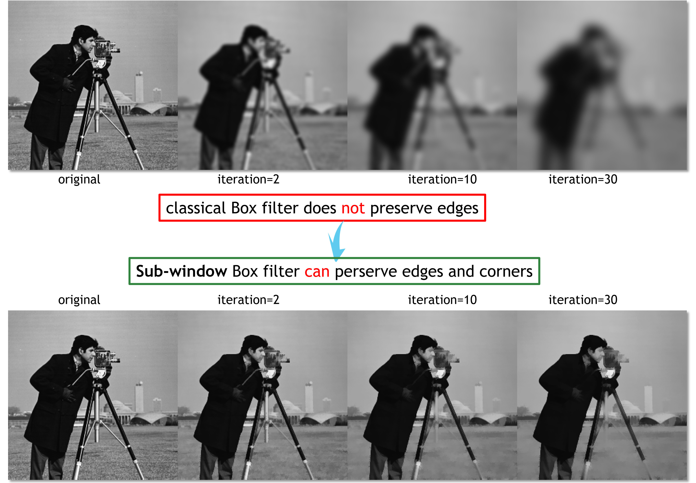

# Side Window Filtering (CVPR2019 oral, #5176)

SideWindowBoxFilter is online. More filters are coming soon :)

## Side Window Box Filter
A typical example to show the side window filter is the side window box filter. The original box filter does not preserve edges. But with side window technique, side window box filter can preserve edges and corners, as shown in following figure. The MATLAB code is provided.


```text
@ARTICLE{gong:cf, 
    author={Yuanhao Gong and Ivo F. Sbalzarini}, 
    journal={IEEE Transactions on Image Processing}, 
    title={Curvature filters efficiently reduce certain variational energies}, 
    year={2017}, 
    volume={26}, 
    number={4}, 
    pages={1786-1798}, 
    doi={10.1109/TIP.2017.2658954}, 
    ISSN={1057-7149}, 
    month={April},}
@inproceedings{swfilter, 
    author={Hui Yin and Yuanhao Gong and Guoping Qiu}, 
    Booktitle = {CVPR}, 
    title={Side Window Filtering}, 
    year={2019}, }
```
